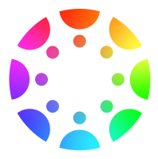

[![Contributors][contributors-shield]][contributors-url]
[![Forks][forks-shield]][forks-url]
[![Stargazers][stars-shield]][stars-url]
[![Issues][issues-shield]][issues-url]
[![MIT License][license-shield]][license-url]

<!-- PROJECT LOGO -->
 

  

<h3 align="center">PimpMyCanvas</h3>

  

Chrome extension for customizing the Canvas LMS UI
     
    <a href="https://github.com/JDipi/impMyCanvas/issues">Report Bug</a>
    ·
    <a href="https://github.com/JDipi/impMyCanvas/issues">Request Feature</a>
  

<!-- TABLE OF CONTENTS -->

  
Table of Contents

  <ol>
    <li>
      <a href="#about-the-project">About The Project</a>
      <ul>
        <li><a href="#built-with">Built With</a></li>
      </ul>
    </li>
    <li>
      <a href="#getting-started">Getting Started</a>
      <ul>
        <li><a href="#installation">Installation</a></li>
      </ul>
    </li>
    <li>
      <a href="#usage">Usage</a>
      <ul>
        <li><a href="#colors">Colors</a></li>
        <li><a href="#theme-library">Theme Library</a></li>
        <li><a href="#gradient">Gradient</a></li>
        <li><a href="#settings">Settings</a></li>
      </ul>
    </li>
    <li><a href="#roadmap">Roadmap</a></li>
    <li><a href="#contributing">Contributing</a></li>
    <li><a href="#license">License</a></li>
    <li><a href="#contact">Contact</a></li>
    <li><a href="#acknowledgments">Acknowledgments</a></li>
  </ol>

### About The Project

#### By JDipi and [ExternalHost0](https://github.com/ExternalHost0)
##### PimpMyCanvas is a lightweight Chrome extension for customizing the Canvas LMS User Interface

This Chrome extension based off of a Tampermonkey userscript my friend ExternalHost0 made. You can find his script [here](https://github.com/ExternalHost0/PimpMyCanvas).

### Built With

* [![JQuery][JQuery.com]][JQuery-url]
* [![Tailwind][tailwind-shield]][Tailwind-url]
* [![DaisyUI][DaisyUI-shield]][DaisyUI-url]
* [![Chrome][Chrome-shield]][Chrome-url]

(<a href="#readme-top">back to top</a>)

### Getting Started

### Installation

You can download the extension from the Chrome Web Store linked below:
### [INSTALL HERE](https://chrome.google.com/webstore/detail/pimpmycanvas/bgpoafmllopbhciofdpjfeoaadfhhhnd)

If you want to manually download the extension go to the releases page on this repository for the crx file, or download the source code and pack it yourself.

(<a href="#readme-top">back to top</a>)

### Usage

Navigate to any Canvas domain and click the extension icon in the top right. This will show the extension window, which looks like this:

  

#### Colors

The colors tab allows you to set colors of your choice for all the major elements in Canvas.

  
  &nbsp;&nbsp;&nbsp;
  

(<a href="#readme-top">back to top</a>)

#### Theme Library

The theme library tab allows you to apply, edit, and delete saved Canvas themes. If you set some colors you like in the colors tab, you can save them as a theme under the theme library tab. PMC also comes with some themes by default, but if you make a custom theme and want it to be included with a future PMC release, there is an option to submit a theme request. I am currently using a [Google Form](https://docs.google.com/forms/d/e/1FAIpQLSe_UoYmPhYp0attrSOfkD9wTuKcJaYobyLp0afcJ5oBWLiarQ/viewform?usp=sf_link) to track theme requests.

  
  &nbsp;&nbsp;&nbsp;
  

(<a href="#readme-top">back to top</a>)

#### Gradient

The gradient tab allows you to customize a gradient that runs along the Canvas sidebar. The stock PMC themes come with gradients, but in order to set your own you must find or create a color palette on [coolors.co](https://coolors.co). See the image on the right for how to get the url from coolors.co.
There are also options to change the angle and speed of the gradient.

  
  &nbsp;&nbsp;&nbsp;
  

(<a href="#readme-top">back to top</a>)

#### Settings

The settings tab has several miscellaneous options, such as importing / exporting themes (in JSON format), reporting issues, getting help, and resetting all PMC settings.

  
  &nbsp;&nbsp;&nbsp;
 

(<a href="#readme-top">back to top</a>)

### Roadmap
- [ ] Add gradient preview swatches
- [ ] Better style for gradient animation speed control
- [ ] Find an alternative to Google Forms for the submission of custom themes
- [ ] Make a button to load the default themes
- [ ] A gradient editor that is independent of coolors.co, hopefully like [this](https://cssgradient.io/) 

(<a href="#readme-top">back to top</a>)

### Contributing

Contributions are what make the open source community such an amazing place to learn, inspire, and create. Any contributions you make are **greatly appreciated**.

If you have a suggestion that would make this better, please fork the repo and create a pull request. You can also simply open an issue with the tag "enhancement".
Don't forget to give the project a star! Thanks again!

1. Fork the Project
2. Create your Feature Branch (`git checkout -b feature/AmazingFeature`)
3. Commit your Changes (`git commit -m 'Add some AmazingFeature'`)
4. Push to the Branch (`git push origin feature/AmazingFeature`)
5. Open a Pull Request

(<a href="#readme-top">back to top</a>)

## License

Distributed under the MIT License. See `LICENSE.txt` for more information.

## Contact

Send us a message! - [pimpmycanvas@googlegroups.com](mailto:pimpmycanvas@googlegroups.com)

## Acknowledgments

* Thank you to my friend [ExternalHost0](https://github.com/ExternalHost0) for making the [userscript](https://github.com/ExternalHost0/PimpMyCanvas) that inspired this extension!

[contributors-shield]: https://img.shields.io/github/contributors/JDipi/PimpMyCanvas.svg?style=for-the-badge
[contributors-url]: https://github.com/JDipi/PimpMyCanvas/graphs/contributors
[forks-shield]: https://img.shields.io/github/forks/JDipi/PimpMyCanvas.svg?style=for-the-badge
[forks-url]: https://github.com/JDipi/PimpMyCanvas/network/members
[stars-shield]: https://img.shields.io/github/stars/JDipi/PimpMyCanvas.svg?style=for-the-badge
[stars-url]: https://github.com/JDipi/PimpMyCanvas/stargazers
[issues-shield]: https://img.shields.io/github/issues/JDipi/PimpMyCanvas.svg?style=for-the-badge
[issues-url]: https://github.com/JDipi/PimpMyCanvas/issues
[license-shield]: https://img.shields.io/github/license/JDipi/PimpMyCanvas.svg?style=for-the-badge
[license-url]: https://github.com/JDipi/PimpMyCanvas/blob/master/LICENSE.txt

[JQuery.com]: https://img.shields.io/badge/jQuery-0769AD?style=for-the-badge&logo=jquery&logoColor=white
[JQuery-url]: https://jquery.com 
[Tailwind-shield]: https://img.shields.io/badge/tailwindcss-06B6D4?style=for-the-badge&logo=tailwindcss&logoColor=white
[Tailwind-url]: https://tailwindcss.com/
[DaisyUI-shield]: https://img.shields.io/badge/daisyui-5A0EF8?style=for-the-badge&logo=daisyui&logoColor=white
[DaisyUI-url]: https://daisyui.com/
[Chrome-shield]: https://img.shields.io/badge/chrome%20extension%20api-FF0000?style=for-the-badge&logo=googlechrome&logoColor=white
[Chrome-url]: https://developer.chrome.com/docs/extensions/reference/